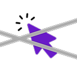
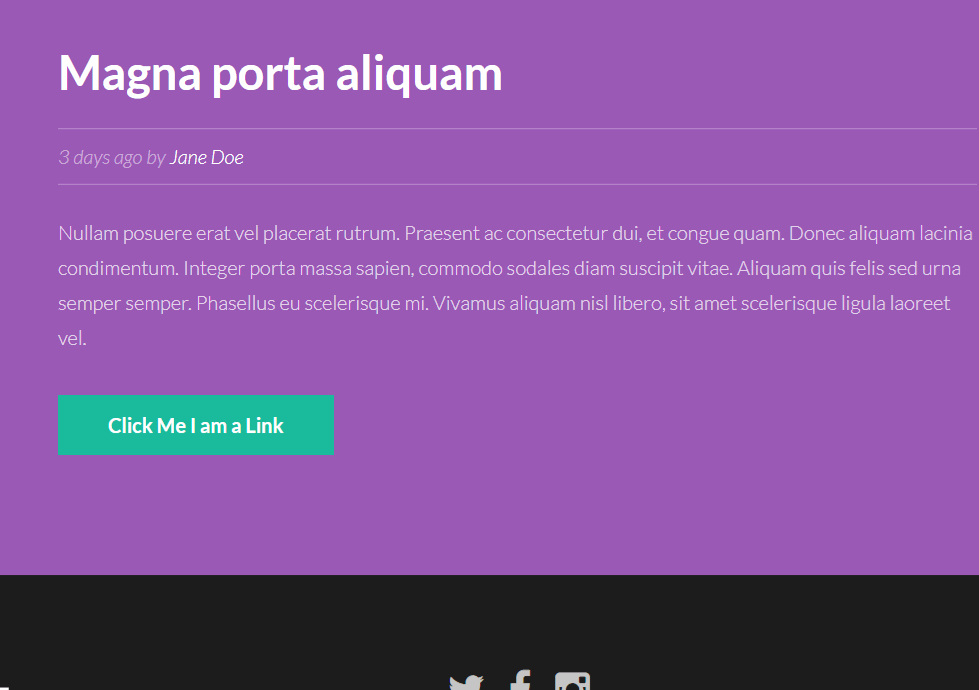

# KeyNav

 

*say no to mouse*

---
Minimal chrome extension for clicking html elements (defaults: button, a) using
keyboard.

Also can scroll vertically.

---
## Installation

To install manually, clone the repo and load unpacked extension from
`chrome://extensions` and point to the repo folder.

## Usage

`CTRL-I` to start/stop extension. ( This key cannot be changed from extension
options page. )

Default settings:

- `f`
: Enter click mode.
- `j`
: To scroll down 300 px. 
- `k`
: To scroll up 300 px.

**You can customize most of the customizable settings in the options page.**

### Demo

## How it works?

**AlgorithAm** 

Graph data structure is used for the working of this extension. Any node in the working
graph can have a job and children. Pressing a key while in a node traverses to
the first of its children mapped with the pressed key. If no child was found
for the pressed key the program exits, if found the job of the traversed node
is executed.

There are three main nodes: scroll up node, scroll down node and the click mode
node. Each and every node in the working graph has the main nodes as children
to work recursively.

The job of scroll nodes is obvious. The job of click mode node is to first
scan the `DOM` for elements ( selection criteria can be heavily customized by
using the standard css selectors ) then filter the elements on visibility in
the current viewport and then generate and append as its child, new graph whose leaf nodes have job
to click on individual filtered elements and exit. 

---
